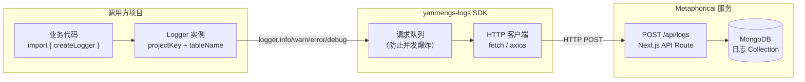
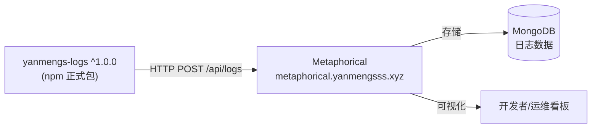

# yanmengs-logs — 日志上报 SDK 架构说明


> **npm 包名**：`yanmengs-logs`  
> **最新版本**：`^1.0.0`（已发布为正式 npm 包）  
> **技术栈**：TypeScript

---

## 一、项目定位

`yanmengs-logs` 是为整个 LifePilot 生态开发的**轻量级日志上报 SDK**，通过 HTTP POST 将结构化日志发送至 **Metaphorical 看板**（`metaphorical.yanmengsss.xyz`）进行集中存储与可视化。

> **升级说明**：原为本地文件依赖（`file:../Metaphorical/yanmengs-logs`），现已升级为**正式 npm 发布包**（`^1.0.0`），任意项目均可直接安装使用，无需本地路径引用。

---

## 二、快速使用

```bash
npm install yanmengs-logs
# 或
pnpm add yanmengs-logs
```

```typescript
import { createLogger } from 'yanmengs-logs';

// 初始化（指定项目标识和日志表名）
const logger = createLogger({
  projectKey: 'lifepilot',      // 项目标识（对应 Metaphorical 中的项目）
  tableName: 'frontend_logs',   // 日志表名（对应 MongoDB Collection）
  // 可选：自定义 Metaphorical 实例地址
  // endpoint: 'https://metaphorical.yanmengsss.xyz/api/logs'
});

// 上报日志
logger.info('user_login', { userId: '123' });
logger.warn('api_slow', { url: '/chat', duration: 3200 });
logger.error('parse_failed', { error: err.message, file: 'doc.pdf' });
logger.debug('state_change', { from: 'idle', to: 'loading' });
```

---

## 三、SDK 架构



---

## 四、日志数据结构

SDK 上报的每条日志包含以下字段：

```typescript
interface LogPayload {
  projectKey: string;    // 项目标识
  tableName: string;     // 目标日志表名
  level: 'info' | 'warn' | 'error' | 'debug';
  message: string;       // 日志描述（第一个参数）
  data?: unknown;        // 附加数据（第二个参数，可选）
  timestamp: string;     // ISO 8601 时间戳（SDK 自动注入）
}
```

---

## 五、SDK API 说明

| 方法 | 参数 | 说明 |
|------|------|------|
| `createLogger(config)` | `{ projectKey, tableName, endpoint? }` | 创建 Logger 实例 |
| `logger.info(msg, data?)` | `string, unknown?` | 上报 INFO 级别日志 |
| `logger.warn(msg, data?)` | `string, unknown?` | 上报 WARN 级别日志 |
| `logger.error(msg, data?)` | `string, unknown?` | 上报 ERROR 级别日志 |
| `logger.debug(msg, data?)` | `string, unknown?` | 上报 DEBUG 级别日志 |

---

## 六、设计原则

- **非侵入性**：日志上报失败不会影响主应用正常运行（内部 try/catch 吞异常）
- **轻量**：无重型依赖，体积极小
- **时间戳自动注入**：无需手动传入时间，SDK 自动注入 ISO 8601 格式时间戳
- **多项目支持**：通过 `projectKey + tableName` 区分不同项目和用途

---

## 七、当前接入项目

| 项目 | projectKey | tableName |
|------|-----------|-----------|
| LifePilot 前端 | `lifepilot` | `frontend_logs` |
| （可扩展接入其他项目） | — | — |

---

## 八、与 Metaphorical 的关系



`yanmengs-logs` 与 `Metaphorical` 是**配套关系**：
- `yanmengs-logs` 负责埋点和上报（客户端 SDK）
- `Metaphorical` 负责接收、存储和可视化（服务端看板）
- 两者通过 HTTP API 解耦，互不依赖对方的实现细节
